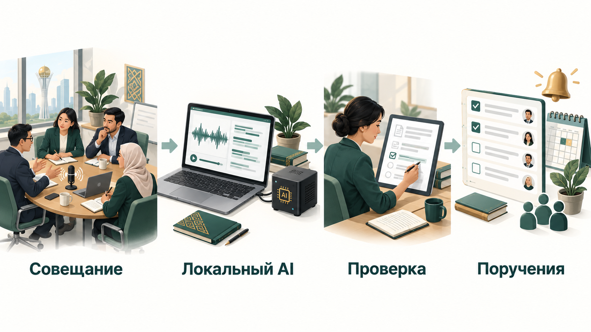
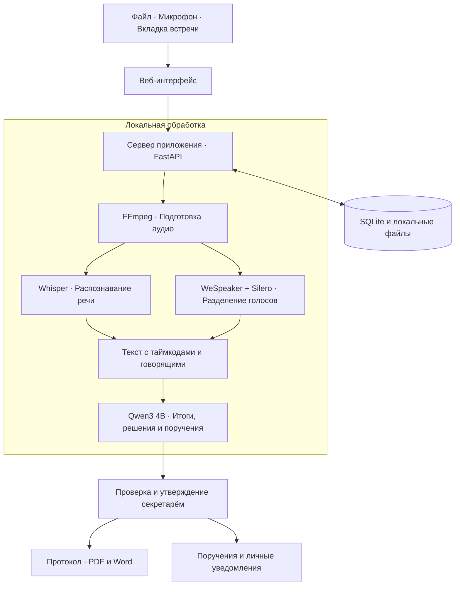

# AI Протоколист · Самрук-Қазына

**От совещания — к готовому протоколу и контролю поручений.**

Приложение записывает встречу или принимает готовое аудио, переводит речь в текст и выделяет главное: решения, поручения, исполнителей и сроки. Секретарь проверяет результат, утверждает протокол и передаёт поручения в работу.

## Как запустить

Нужны **Python 3.11 или 3.12**, **FFmpeg** и установленная **Ollama**. Для записи онлайн-встреч используйте **Chrome**. Запуск через скрипты рассчитан на macOS и Linux.

1. Скачайте проект и перейдите в его папку:

   ```bash
   git clone https://github.com/BAITC-Hacks/hack-d5e592cf-daladigital.git
   cd hack-d5e592cf-daladigital
   ```

2. Откройте приложение Ollama. Если используете терминал, запустите `ollama serve` в отдельном окне и оставьте его работать.

3. Установите зависимости и локальные модели, затем запустите приложение:

   ```bash
   bash scripts/setup.sh
   bash scripts/start.sh
   ```

4. Откройте **[http://127.0.0.1:8000](http://127.0.0.1:8000)** — приложение сразу откроется под секретарём **Айгерим Сапаровой**, без регистрации и пароля. Сотрудника и роль можно сменить в сайдбаре.

При любом способе запуска по умолчанию включается готовая демонстрация без регистрации и пароля. Автоматически создаются демонстрационные сотрудники, протоколы и поручения в отдельном хранилище `demo-data`. Учебные примеры подготовлены вручную; для обработки своей записи используйте **«Новое совещание»**.

Установка выполняется один раз и требует интернета для загрузки моделей. При следующих запусках достаточно открыть Ollama и выполнить `bash scripts/start.sh`.

## Что уже работает

Основные функции реализованы в локальном приложении:

- **Запись совещаний:** с микрофона, из вкладки Meet, Zoom или Teams, а также загрузка готового аудио или видео.
- **Расшифровка:** текст с таймкодами и разделением реплик по голосам; модель поддерживает русский и казахский языки.
- **Подготовка протокола:** тематический текст, краткие итоги, решения и поручения с исполнителями и сроками.
- **Проверка и утверждение:** редактирование результата и переход к нужному фрагменту исходной записи.
- **Экспорт:** скачивание протокола в **PDF и Word**.
- **Контроль поручений:** статусы исполнения, ближайшие сроки и просрочки.
- **Личные уведомления:** новое поручение после утверждения протокола, напоминания о сроках и просрочке внутри приложения.
- **Роли доступа:** администратор, секретарь и наблюдатель; общий архив совещаний.

Для онлайн-встреч пользователь открывает встречу и разрешает захват звука вкладки. Имена, формулировки и сроки проверяет секретарь перед утверждением.

## Как это работает



1. **Проведите встречу** или загрузите запись.
2. **Получите черновик:** расшифровку, итоги и список поручений.
3. **Проверьте и утвердите** протокол.
4. **Скачайте документы** и отслеживайте исполнение поручений.

## Какие локальные модели используем

| Модель | Для чего |
| --- | --- |
| **Qwen3 4B** через Ollama (`qwen3:4b`) | Анализ разговора, подготовка итогов, выделение решений и поручений |
| **Whisper large-v3-turbo** через faster-whisper | Преобразование речи в текст с таймкодами |
| **WeSpeaker ResNet34 + Silero VAD** | Разделение реплик по голосам и определение участков речи |

После установки основной конвейер обрабатывает аудио **локально, без отправки в облачные AI-сервисы**. Записи, протоколы и поручения хранятся на компьютере или локальном сервере приложения.

## Архитектура



**Веб-интерфейс** объединяет запись, архив и поручения. **Сервер** управляет доступом и очередью обработки; локальные модели готовят черновик, а человек подтверждает результат. **SQLite и файловое хранилище** сохраняют записи, документы, статусы и историю изменений.

Отдельные экспериментальные боты для подключения к встречам описаны в [Google Meet](MEET_MVP.md) и [Teams](MVP.md). Они не входят в основной локальный конвейер; для них предусмотрены отдельные режимы обработки.

## Команда и дальнейшее развитие

У нашей команды есть опыт разработки решений для государственного сектора. Мы готовы продолжить развитие продукта совместно с заказчиком: адаптировать его к рабочим процессам, провести пилот в реальной среде и доработать решение по обратной связи сотрудников.


## План деплоя

1. **Демонстрация:** установить приложение и модели на компьютер, запустить `bash scripts/start.sh`. Готовые роли и примеры открываются без регистрации; демонстрационное хранилище отделено от рабочего архива.
2. **Пилот в организации:** выделить локальный сервер, установить Ollama и модели, подключить постоянное хранилище. Запустить рабочий режим командой `PROTOCOL_DEMO_MODE=0 bash scripts/start.sh` и создать администратора на сервере. Для рабочей среды используется отдельный архив `data` и вход по паролю.
3. **Доступ сотрудников:** настроить внутренний адрес и HTTPS через обратный прокси, ограничить доступ сетью организации или VPN, выдать сотрудникам роли. Деморежим в рабочей среде отключить.
4. **Эксплуатация:** настроить автоматический запуск сервера и Ollama, резервное копирование записей и базы, журналирование и наблюдение за очередью обработки.
5. **Развитие после пилота:** собрать обратную связь на реальных совещаниях, улучшить качество русского и казахского распознавания, согласовать интеграцию с корпоративным входом и СЭД.
