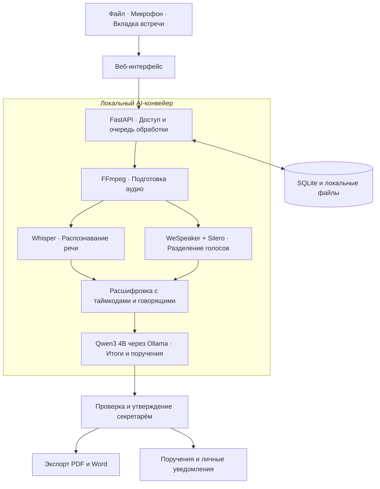

# AI Протоколист · Самрук-Қазына

**От совещания — к проверенному протоколу и контролю поручений.**

## О проекте

После совещаний секретарям и руководителям приходится вручную разбирать записи, оформлять решения и следить за исполнением. AI Протоколист превращает аудио в расшифровку, краткие итоги и поручения с исполнителями и сроками.

Решение предназначено для секретарей, руководителей и сотрудников государственных и корпоративных организаций. Основной AI-конвейер работает локально: после загрузки моделей аудио не отправляется в облачные AI-сервисы. Перед утверждением результат проверяет человек.

## Посмотреть результат без установки

Готовые протоколы можно открыть прямо на GitHub — без запуска приложения и загрузки моделей:

- [Модернизация производственной площадки](docs/protocols/01-chemical-industry.md): саммари, решения и 6 поручений с исполнителями и сроками.
- [Пилот цифрового документооборота](docs/protocols/02-operational-meeting.md): 6 поручений, риски и реплики-основания.

Это вымышленные учебные примеры, написанные вручную для демонстрации структуры результата. [Все примеры](docs/protocols/README.md).

## Что реализовано

- **Получение аудио:** загрузка MP3, WAV, M4A, MP4, WebM и OGG; запись микрофона; захват звука вкладки онлайн-встречи в Chrome.
- **Расшифровка:** текст с таймкодами и разделением реплик по голосам; многоязычная модель с поддержкой русского и казахского.
- **Анализ:** тематический протокол, отдельное саммари, решения и поручения с предложенными исполнителями и сроками.
- **Проверка:** прослушивание нужного фрагмента, исправление текста, имён и поручений, утверждение протокола.
- **Документы:** экспорт черновика или утверждённого протокола в PDF и Word.
- **Исполнение:** статусы поручений, ближайшие сроки и просрочки.
- **Уведомления:** назначение после утверждения, напоминания за 3 дня до срока и при просрочке — в личных входящих приложения.
- **Доступ:** роли администратора, секретаря и наблюдателя; общий архив, история изменений и удаление записей администратором.
- **Готовая демонстрация:** автоматический локальный вход без регистрации, три учебных профиля и примеры протоколов и поручений.

## Как работает решение


1. Пользователь открывает **«Новое совещание»**, загружает запись или выбирает микрофон / вкладку встречи.
2. Приложение подготавливает аудио, распознаёт речь и разделяет реплики по голосам.
3. Локальная модель выделяет темы, итоги, решения и поручения.
4. Секретарь сверяет черновик с записью, уточняет имена, исполнителей и сроки, затем утверждает протокол.
5. Протокол доступен в PDF и Word, поручения — в разделе **«Поручения»**, назначения и напоминания — во входящих выбранных сотрудников.

## Технологии и AI-модели

| Компонент | Технологии и назначение |
| --- | --- |
| Интерфейс | HTML, CSS, JavaScript; браузерные MediaRecorder и Web Audio API для записи и смешивания звука |
| Сервер | Python 3.11–3.12, FastAPI, Uvicorn, Pydantic; HTTP API и очередь обработки |
| Хранилище | SQLite для пользователей, протоколов, поручений и событий; локальные файлы для аудио |
| Обработка аудио | FFmpeg: извлечение звука и приведение записи к единому формату |
| Распознавание | **Whisper large-v3-turbo**, запуск через **faster-whisper** на CPU с INT8 |
| Разделение голосов | **WeSpeaker ResNet34**, **Silero VAD**, библиотека **diarize** |
| Анализ содержания | **Qwen3 4B** (`qwen3:4b`) через локальный сервис **Ollama** |
| Экспорт | **python-docx** для Word, **ReportLab** для PDF |

Основному приложению не нужен ключ облачного AI API. Отдельный экспериментальный модуль `meeting_bot/` использует Playwright и средства захвата аудио; в его облачном режиме предусмотрены OpenAI API, `gpt-4o-transcribe-diarize` и `gpt-4.1-mini`. Этот модуль запускается отдельно и не участвует в основном локальном сценарии.

## Архитектура проекта



- `app/static/` — страницы приложения, запись аудио и взаимодействие с API.
- `app/main.py`, `app/auth.py` — HTTP API, сессии и проверка прав.
- `app/service.py`, `app/inference.py` — очередь и локальная обработка записи.
- `app/store.py`, `app/reminders.py` — хранение, статусы и напоминания.
- `app/exports.py` — формирование PDF и DOCX.
- `app/demo.py` — учебные профили и примеры для демонстрации.
- `scripts/` — установка, запуск и вспомогательные инструменты.

## Установка и запуск

**Требования:** macOS или Linux, Git, Python 3.11 или 3.12, FFmpeg с `ffprobe`, Ollama. Для записи вкладки используйте Chrome. На Linux нужен Unicode-шрифт для PDF. Для первой установки требуется интернет и свободное место под модели и записи; рекомендуется от 8 ГБ дискового пространства.

### 1. Скачайте проект

```bash
git clone https://github.com/BAITC-Hacks/hack-d5e592cf-daladigital.git
cd hack-d5e592cf-daladigital
```

Если проект уже скачан, обновите его через `git pull` и перезапустите приложение.

### 2. Запустите Ollama

Откройте установленное приложение Ollama либо выполните в отдельном терминале:

```bash
ollama serve
```

### 3. Подготовьте модели и запустите приложение

В терминале из папки проекта:

```bash
bash scripts/setup.sh
bash scripts/start.sh
```

Установка создаёт Python-среду, устанавливает зависимости и загружает локальные модели. Для следующих запусков достаточно работающей Ollama и команды `bash scripts/start.sh`.

### 4. Откройте приложение

**[http://127.0.0.1:8000](http://127.0.0.1:8000)**

При локальном запуске по умолчанию приложение **сразу открывается под секретарём Айгерим Сапаровой — без регистрации, пароля и создания администратора**. Данияр Омаров и Мадина Серикова доступны через **«Сменить роль»** в сайдбаре. Демоданные автоматически создаются в отдельном каталоге `demo-data`.

Если порт занят, можно использовать `PROTOCOL_PORT=8001 bash scripts/start.sh` и открыть `http://127.0.0.1:8001`.

## Как проверить решение: сценарий для жюри

### Готовый сценарий за 2–3 минуты

1. Откройте приложение: выбран профиль секретаря **Айгерим Сапаровой**.
2. В разделе **«Протоколы»** откройте **«[ДЕМО] Протокол для проверки секретарём»**. Посмотрите текст, итоги и поручение; при необходимости отредактируйте его.
3. Утвердите протокол и скачайте PDF или Word.
4. Переключитесь в сайдбаре на **Данияра Омарова**. В **«Уведомлениях»** появится назначение из утверждённого протокола.
5. Откройте поручение из уведомления, отметьте уведомление прочитанным и посмотрите ближайшие и просроченные сроки в разделе **«Поручения»**.
6. Переключитесь на **Мадину Серикову**: её личные входящие содержат назначения для неё.

Учебные примеры написаны вручную и демонстрируют работу интерфейса, экспорта и уведомлений; они не являются результатом распознавания аудио. Готовые образцы документов: [PDF](docs/examples/sample-protocol.pdf) и [Word](docs/examples/sample-protocol.docx).

### Обработка своей записи

Под профилем секретаря откройте **«Новое совещание» → «Готовая запись»**, выберите короткое аудио с чётким поручением, например: «Айгерим, подготовьте отчёт к 30 сентября 2026 года». Укажите тему и дату встречи, подтвердите право на загрузку и запустите обработку. После завершения сравните расшифровку и поручение с исходной записью, укажите получателя напоминаний и утвердите протокол. Время обработки зависит от компьютера и длительности аудио.

## Данные и интеграции

- **Входные данные:** аудио и видео пользователя, микрофон, звук выбранной вкладки встречи. Загрузка — до 500 МБ на файл.
- **Meet, Zoom, Teams:** в основном приложении пользователь сам входит во встречу и разрешает браузеру захват звука. Подключение через официальные API этих платформ не требуется.
- **Модели:** скачиваются при установке; во время обработки используются локальные веса и локальный API Ollama.
- **Хранение:** по умолчанию в `~/Library/Application Support/AI-Protokolist` на macOS или `~/.local/share/ai-protokolist` на Linux. Демонстрация использует `demo-data`, режим с паролями — отдельный каталог `data`.
- **Учебные данные:** вымышленные профили и протоколы; адреса с доменом `.test` служат примерами, письма на них не отправляются.
- **Дополнительные прототипы:** [Google Meet](MEET_MVP.md) и [Teams](MVP.md). Облачный режим отдельного бота отправляет аудио в OpenAI и требует API-ключ; основной локальный конвейер этого не делает.

## Ограничения текущей версии

- AI готовит черновик: имена, исполнителей, сроки и формулировки необходимо проверить перед утверждением. Качество зависит от языка, шума и пересекающейся речи.
- Обработка выполняется локально; длинные записи на CPU могут занимать значительное время. Очередь обрабатывает записи последовательно.
- Уведомления доступны внутри приложения при работающем сервере. Отправка в email, Telegram и СЭД не реализована.
- Полностью автономное подключение бота не входит в основной сценарий. Отдельные боты экспериментальные и не интегрированы в интерфейс `app/`.
- Демовход без пароля доступен только с компьютера сервера и предназначен для демонстрационного архива. Корпоративный SSO, шифрование хранилища и промышленная эксплуатация требуют доработки.
- Прототип не заявляет подтверждённую точность на всех типах русской, казахской и смешанной речи; её нужно оценить на материалах пилота.

## Развёрнутая версия

Публичный URL развёрнутой версии в репозитории не указан. Жюри может запустить приложение локально по инструкции выше и открыть **[http://127.0.0.1:8000](http://127.0.0.1:8000)**. Это локальный адрес, а не общедоступная ссылка.

## Команда и дальнейшее развитие

У нашей команды есть опыт разработки решений для государственного сектора. Мы готовы продолжить развитие продукта совместно с заказчиком: адаптировать его к рабочим процессам, провести пилот в реальной среде и доработать решение по обратной связи сотрудников.

## План деплоя

1. **Демонстрация:** установить приложение и модели на компьютер. Готовые роли и примеры открываются без регистрации; демонстрационное хранилище отделено от рабочего архива.
2. **Пилот:** выделить локальный сервер, установить модели и подключить постоянное хранилище. Запустить рабочий режим через `PROTOCOL_DEMO_MODE=0 bash scripts/start.sh`, создать администратора на сервере и выдать роли сотрудникам.
3. **Доступ:** настроить внутренний адрес и HTTPS через обратный прокси, ограничить доступ сетью организации или VPN. Деморежим в рабочей среде отключить.
4. **Эксплуатация:** настроить автоматический запуск приложения и Ollama, резервное копирование базы и записей, журналирование и наблюдение за очередью обработки.
5. **Развитие:** провести пилот на реальных совещаниях, улучшить качество распознавания и согласовать интеграции с корпоративным входом и СЭД.
